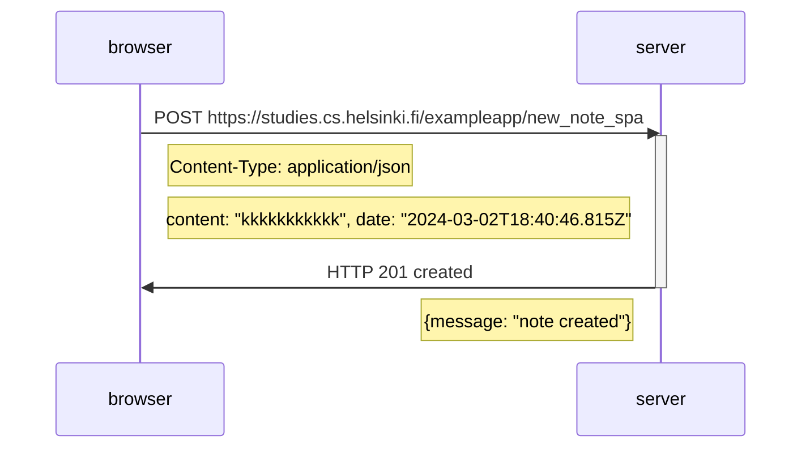

```mermaid
sequenceDiagram
    participant browser
    participant server

    browser->>server: POST https://studies.cs.helsinki.fi/exampleapp/new_note_spa
    activate server
    Note right of browser: Content-Type: application/json
    Note right of browser: content: "kkkkkkkkkkk", date: "2024-03-02T18:40:46.815Z"
    server->>browser: HTTP 201 created
    deactivate server
    Note left of server: {message: "note created"}
```
